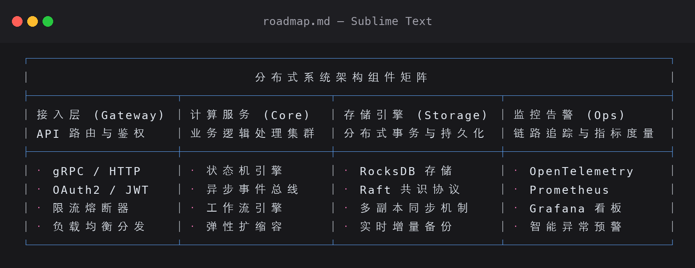

# MD Table Format (Sublime Text Plugin)

[English](README.md) | [中文文档](README_zh.md)

---

An intelligent Markdown and Unicode table alignment plugin for **Sublime Text 3 and 4**.

When editing Markdown files (both inside fenced code blocks ` ``` ` and in standard body text), this plugin formats and realigns **Unicode Box-drawing tables** and **Markdown pipe tables** with pixel-perfect precision according to **strict East Asian Monospace Width rules (1 CJK / Full-width character / Emoji = 2 column widths; 1 ASCII character = 1 column width)**.

---

## 🌟 Key Features

- 📏 **Strict East Asian Monospace Character Width Calculation**:
  - CJK characters (Chinese, Japanese, Korean), full-width punctuation (`（）`, `【】`, `，`, `。`), and standard emojis (`🚀`, `✅`, `⭐`, etc.) are counted as **2 columns wide**.
  - ASCII letters, digits, half-width punctuation, and spaces are counted as **1 column wide**.
  - Zero-width characters (zero-width joiners, variation selectors, control marks) are counted as **0 columns wide**.
- 📦 **Comprehensive Box Table Styles (Unicode & ASCII)**:
  - Single-line box: `┌─┬─┐`, `│ │ │`, `├─┼─┤`, `└─┴─┘`
  - Double-line box: `╔═╦═╗`, `║ ║ ║`, `╠═╬═╣`, `╚═╩═╝`
  - Rounded-corner box: `╭─┬─╮`, `│ │ │`, `├─┼─┤`, `╰─┴─╯`
  - Heavy-line box: `┏━┳━┓`, `┃ ┃ ┃`, `┣━╋━┫`, `┗━┻━┛`
  - ASCII grid box: `+---+`, `|   |`, `+===+`
- 🏷️ **Multi-Column Spanning Headers & Dynamic Junctions**:
  - Automatically recognizes spanning title headers (e.g., top title banner), computes aggregate column width, and centers the text.
  - Dynamically synthesizes topological border junctions (`┬`, `┴`, `┼`, `─`) according to adjacent row partitions.
- 📝 **Markdown GFM Pipe Tables**:
  - Formats standard `| col1 | col2 |` pipe tables.
  - Preserves alignment indicators: `:---` (left), `:---:` (center), `---:` (right).
- 💾 **Auto Format on Save**:
  - Automatically scans and realigns tables when saving `.md` files (configurable for whole file or code-blocks only).
- 🎯 **Context-Aware Formatting**:
  - Cursor inside table: formats only the current table.
  - Active selection: formats all tables intersecting the selection.
  - No selection & outside tables: formats all tables in the document.
- 🔌 **Zero Dependencies & Broad Compatibility**:
  - Pure Python implementation with zero third-party packages.
  - Compatible with **Sublime Text 3 (Python 3.3+)** and **Sublime Text 4 (Python 3.8+)** on macOS, Windows, and Linux.

---

## 📸 Alignment Showcase

### Example 1: Unicode Box-Drawing Table (Mixed CJK & Spanning Header)



#### Raw Source Comparison:
```text
[Before Formatting]
┌───────────────────────────────────────────────────────────┐
│                 分布式系统架构组件矩阵                     │
├──────────────┬──────────────┬──────────────┬──────────────┤
│ 接入层 (Gateway)│ 计算服务 (Core)│ 存储引擎 (Storage)│ 监控告警 (Ops)│
│ API 路由与鉴权│ 业务逻辑处理集群│ 分布式事务与持久化│ 链路追踪与指标度量│
├──────────────┼──────────────┼──────────────┼──────────────┤
│ · gRPC / HTTP │ · 状态机引擎 │ · RocksDB 存储│ · OpenTelemetry│
│ · OAuth2 / JWT│ · 异步事件总线│ · Raft 共识协议│ · Prometheus  │
│ · 限流熔断器 │ · 工作流引擎  │ · 多副本同步机制│ · Grafana 看板 │
│ · 负载均衡分发│ · 弹性扩缩容  │ · 实时增量备份 │ · 智能异常预警 │
└──────────────┴──────────────┴──────────────┴──────────────┘

[After Formatting]
┌───────────────────────────────────────────────────────────────────────────────┐
│                            分布式系统架构组件矩阵                             │
├──────────────────┬──────────────────┬────────────────────┬────────────────────┤
│ 接入层 (Gateway) │ 计算服务 (Core)  │ 存储引擎 (Storage) │ 监控告警 (Ops)     │
│ API 路由与鉴权   │ 业务逻辑处理集群 │ 分布式事务与持久化 │ 链路追踪与指标度量 │
├──────────────────┼──────────────────┼────────────────────┼────────────────────┤
│ · gRPC / HTTP    │ · 状态机引擎     │ · RocksDB 存储     │ · OpenTelemetry    │
│ · OAuth2 / JWT   │ · 异步事件总线   │ · Raft 共识协议    │ · Prometheus       │
│ · 限流熔断器     │ · 工作流引擎     │ · 多副本同步机制   │ · Grafana 看板     │
│ · 负载均衡分发   │ · 弹性扩缩容     │ · 实时增量备份     │ · 智能异常预警     │
└──────────────────┴──────────────────┴────────────────────┴────────────────────┘
```

---

### Example 2: Markdown Pipe Table (with Column Alignments)


#### Raw Source Comparison:
```markdown
[Before Formatting]
| 模块名称 | 开发状态 | 优先级 | 负责人 | 预期完成时间 |
|---|:---:|:---:|---|---|
| 用户认证中心 (SSO) | 进行中 | P0 | 张三 | 2026-Q3 |
| 高性能数据流管道 | 已完成 | P0 | 李四 / Bob | 2026-Q2 |
| 实时指标看板展示 | 待排期 | P1 | 王五 | 2026-Q4 |
| 多语言国际化支持 | 规划中 | P2 | Alice | 2027-Q1 |

[After Formatting]
| 模块名称           | 开发状态 | 优先级 | 负责人     | 预期完成时间 |
| ------------------ | :------: | :----: | ---------- | ------------ |
| 用户认证中心 (SSO) |  进行中  |   P0   | 张三       | 2026-Q3      |
| 高性能数据流管道   |  已完成  |   P0   | 李四 / Bob | 2026-Q2      |
| 实时指标看板展示   |  待排期  |   P1   | 王五       | 2026-Q4      |
| 多语言国际化支持   |  规划中  |   P2   | Alice      | 2027-Q1      |
```

---

## 💡 Why Does Text Drift on Web/GitHub Previews & Recommended Fonts

On web browsers (such as GitHub's web code block preview), default monospace fonts (e.g. `SF Mono`, `Consolas`) lack CJK glyphs. When rendering Chinese characters, the browser falls back to the system's proportional CJK font (e.g., `PingFang SC` or `Microsoft YaHei`). Since fallback CJK glyph widths are **not strictly 2.0x integer multiples** of Latin monospace characters in web browsers, visual border drift occurs on web pages.

However, inside **Sublime Text, VS Code, or modern terminal emulators** configured with a true CJK monospace font, the text layout is strictly aligned with 100% mathematical precision.

### 🎨 Recommended Fonts for Sublime Text

To achieve perfect 1:2 Chinese-to-English alignment in your editor:

1. **[Sarasa Gothic / Sarasa Mono SC (更纱黑体)](https://github.com/be5invis/Sarasa-Gothic)** — Specifically engineered for 1:2 CJK monospace alignment (Highly Recommended ⭐⭐⭐⭐⭐)
2. **[Maple Mono CJK](https://github.com/subframe7536/maple-font)**
3. **[Cascadia Code](https://github.com/microsoft/cascadia-code)**

**Configuring Sublime Text**:
Open `Preferences` -> `Settings` and add:
```json
{
    "font_face": "Sarasa Mono SC",
    "font_size": 13
}
```

---

## 🚀 Installation

### Method 1: Manual Installation / Symlink (Recommended)

1. In Sublime Text menu bar, navigate to **`Preferences` -> `Browse Packages...`** to open your `Packages` directory.
2. Clone or symlink this repository into that folder with the folder name `md_table_format`:

**macOS**:
```bash
# Via Symlink
ln -s /path/to/md_table_format ~/Library/Application\ Support/Sublime\ Text/Packages/md_table_format

# Or via Git Clone
cd ~/Library/Application\ Support/Sublime\ Text/Packages/
git clone https://github.com/your-username/md_table_format.git
```

**Windows**:
```powershell
cd "$env:APPDATA\Sublime Text\Packages"
git clone https://github.com/your-username/md_table_format.git
```

**Linux**:
```bash
cd ~/.config/sublime-text/Packages/
git clone https://github.com/your-username/md_table_format.git
```

---

## ⌨️ Usage & Keybindings

| Action | macOS Shortcut | Windows / Linux Shortcut |
| :--- | :--- | :--- |
| **Format table under cursor / selection** | `Super + Alt + T` (`⌘ + ⌥ + T`) | `Ctrl + Alt + T` |
| **Format all tables in document** | `Super + Alt + Shift + T` | `Ctrl + Alt + Shift + T` |

### 1. Command Palette
Press `Cmd + Shift + P` (Mac) or `Ctrl + Shift + P` (Win/Linux) and search for `MD Table`:
- `MD Table Format: Format Table (Under Cursor / Selection)`
- `MD Table Format: Format All Tables in Document`
- `MD Table Format: Toggle Auto Format on Save`

### 2. Context Menu & Main Menu
- **Context Menu**: Right-click anywhere in a Markdown file and select `Format Markdown Table`.
- **Main Menu**: `Edit` -> `MD Table Format`.

---

## ⚙️ Configuration Reference (`MDTableFormat.sublime-settings`)

Open `Preferences` -> `Package Settings` -> `MD Table Format` -> `Settings` to configure options:

```json
{
    // Auto-format tables when saving Markdown files (default: true)
    "format_on_save": true,

    // When formatting document or on save:
    // - true: Only format tables inside fenced code blocks (``` ... ```)
    // - false: Format all tables in the entire file (both inside and outside code blocks)
    "format_in_code_blocks_only": false,

    // Enable formatting for Unicode and ASCII box-drawing tables
    "format_box_tables": true,

    // Enable formatting for Markdown pipe tables (| a | b |)
    "format_pipe_tables": true,

    // Treat Unicode Ambiguous East Asian Width ('A') characters as 2 columns (default false: 1 column)
    "ambiguous_as_wide": false
}
```

---

## 🧪 Running Unit Tests

To run the built-in test suite verifying width calculation, box tables, and pipe tables:

```bash
python3 -m unittest discover tests -v
```

---

## 📄 License

MIT License © 2026
